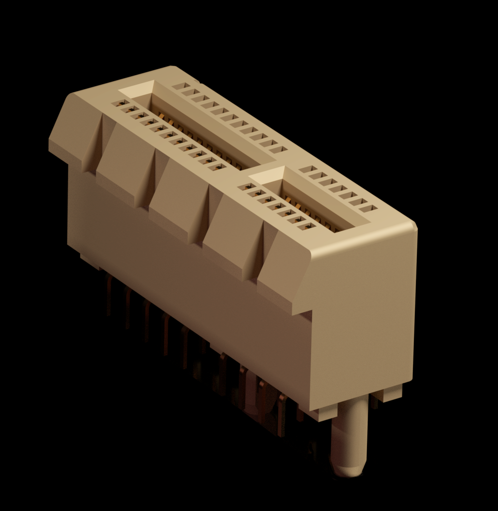

# Technology
Domino4 is a rapid electronics development solution for developing, making products and learning. Without soldering, wiring, breadboarding, or hardware knowledge, the user can assemble a circuit in a matter of minutes, and get straight to coding. This section covers Technical Specifications. 

## Strategy

As these xChips are used to understand electronics whether it is simple IoT (Internet of Things) or special use case, such as on board satellites, certain strategies has been incorporated as many places as possible:

### Redundancy

All connection points offers redundancy. 

With the standard xBus, the redundancy is achieved when xChips are connected in squares. Eg. 4x xChips in a 2x2 configuration uses 4 connectors, but only 3 are necessary to achieve connectivity. 9x xChips in a 3x3 configuration is assembled with 12 connectors, but only 8 are needed, and so on.

With the CAN Bus and the Extension slot both have their pins (not mirrored), but flipped, allowing them to be inserted upside down, this creates a 2x redundancy. Furthermore the CAN Bus is located in both end of the extended core, and when inserted to an experimental container, both end are connected giving a 4x redundancy.

## 1. xChip Layout

Each xChip are a multiple of 32x32 mm.

### 1.1 xBus

xChips have a xBus connection space for each 32mm side, unless component size limits space for the connector on some sides. 

| Top Side Pin | Name | Type | Description |     | Bottom Side Pin | Name | Type | Description |
| ---: | --- | --- | --- | --- | ---: | --- | --- | --- |
| 1   | SCL | Signal | I2C |     | 6   | Reset | Signal | Reset |
| 2   | SDA | Signal | I2C |     | 7   | Prog | Signal | Programming Pin |
| 3   | GND | Power | Ground |     | 8   | RX/TX | Signal | Serial Receive/Transmit |
| 4   | Vcc | Power | 3.3 volt |     | 9   | TX/RX | Signal | Serial Transmit/Receive |
| 5   | Vsrc | Power | Power from original power source |     | 10  | IO | Signal | GPIO |

## 2. Configuration

### 2.1 I2C Protocol

Domino4's mission is to simplify building electronic devices. We have chosen I2C as the only communication protocol between xChips. In doing so we have eliminating the need to understand the pins and wiring in general.

### 2.2 SPI

SPI is only available via the 1mm Extension slot on the extended core (CWV) and the battery core (CWB).

### 2.3 Serial

> also known as UART or RS232C

Even though Serial is found on the xBus, we mainly use it for simple programming. Some other xChips, such as the INA (GNSS (GPS)) xChip might also use it. In that case the xChip has to be removed before programming.

### 2.3 IO - General-purpose input/output

Thi spin is connected to the Core like this
| Core | ChipSet | IO Name | Physical Pin | Functionality |
| --- | --- | --- | --- | --- | 
| CWA - Standard Core | ESP32-WROOM-32 | GPIO2 | 24 | Touch2 RTC12 ADC2_2 |
| CWV - Extended Core | ESP32-WROOM-32 | nc | nc | n/a |
| CWB - Battery Core | ESP32-C3 | GPIO0 | 4 | ADC1_0 |

## 3. CAN Bus Interface

### 3.1 Layout

The CAN bus interface found only on the extended core [CVW](https://github.com/domino4com/CWV) is based on a PCI Express connector, specifically the PCI Express X1.

This connector has 7 pins on the short side, and in order to make the connector reversible, we only use 7 pins on the long side as well. Pin 14 on the top side has pin 1 below it on the bottom side, hence the core can be inserted either way into a PCI-E connector.

### 3.2 Pinout

Coverage Definition:
- `Internal` refers to same pins as on the xBus connector, so own developed PCBs can interface using this connector instead of xBus connector. These pins are *NOT* used when multiple extended cores are stacked together in a mission.
- `External` refers to pins used to communicate between extended cores and mission control cores. These and the power (`Global`) pins are the only one used in this case.

| Pin | Coverage | Name | Type | Description | 
| ---: | :---: | --- | --- | --- |
| 1   | `Global` | Vcc | Power | 3.3 volt | 
| 2   | `Global` | Vsrc | Power | Power from original power source | 
| 3   | `Internal` | IO | Signal |  |  
| 4   | `External` | CAN High | Signal | From CAN Transciever |  
| 5   | `External` | CAN Low | Signal |  From CAN Transciever|  
| 6   | `External` | CAN Enable | Signal |  See CAN Enable note|  
| 7   | `External` | EXT Enable | Signal |  See EXT Enable note|  
| 8   | `Internal` | Reset | Signal |  |  
| 9   | `Internal` | PROG | Signal |  |  
| 10  | `Internal` | TXD | Signal |  Serial Transmit/Receive|  
| 11  | `Internal` | RXD | Signal | Serial Transmit/Receive |  
| 12  | `Internal` | SDA | Signal | I2C |  
| 13  | `Internal` | SCL | Signal | I2C |  
| 14  | `Global` | GND | Power | Ground |    

### 3.3 Pinout notes
 
#### 3.3.1 CAN Enable Note

This pin is connected to a IO pin on the mission control core and can remotely enable/disable comms on the CAN bus for a particulate core. This is used if a core is out of control, say flooding the CAN bus.

#### 3.3.2 EXT Enable Note

Similar to CAN Enable, this is signal passed through to the extension slot that can hold alternative communication media, such as Ethernet connection. The Ethernet connection also have a enable/disable function allowing the mission control core to stop a specific core out of control from flooding the Ethernet connection.

#### 3.3.4 Power Note

Like the enable pins above allowing the mission control to control communiucation from the indvidual cores, power is also regulated, but before it reaches the extended core. Using the CAN Bus interface, power is provided on both side, both for redundany, but also spreading the load (heat) on the backbone. The power will be limited using resettable fuses, but might be upgraded down the line to measure, warn and kill power intelligently. 

## 4. Extension Slot

The Extension Slot can be found  on the extended core [CWV](https://github.com/domino4com/CWV) as well as on the battery core [CWB](https://github.com/domino4com/CWB)

### 4.1 Layout
The extension slot is using a SFP (Small Form Factor Pluggable) connector.
TODO: Image

This connector has 10 pins on the both sides, and in order to make the connector reversible, we reuse the 10 pins on the bottom side. Pin 10 on the top side has pin 1 below it on the bottom side, hence the extension modules can be inserted either way into a SFP connector.

> The PCB for the extension slot needs to be **1mm** thick, unlike the standard 1.6mm thickness used everywhere else.

### 4.2 Pinout

TODO: Pinout diagram

| Pin | Group | Name | CWV pin | CWB pin |Description | 
| ---: | :---: | --- | --- | --- | --- |
| 1   | `Power` | Vcc |  | |3.3 volt | 
| 2   | `SPI` | MISO |  |  |  |
| 3   | `SPI` | MOSI |  |  |  |
| 4   | `SPI` | SCK |  |  |  |
| 5   | `GPIO` | | x | x|  |
| 6   | `GPIO` | | x | x|  |
| 7   | `GPIO` | | x | x|  |
| 8  | `I2C` | SCL |  |  |  |
| 9  | `I2C` | SDA |  |  |  |
| 10 | `Power` | GND |  |  |  |
